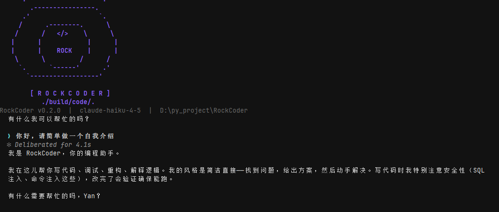

# RockCoder

RockCoder 是一个基于 Python 构建的智能编程助手，支持代码分析、任务规划、文件修改、命令执行、测试验证及多 Agent 协作，覆盖从需求理解到代码落地的完整开发流程。

## 技术栈

**Python / Textual / AsyncIO / MCP / ReAct / Skill / Multi-Agent / Git Worktree**

## 核心设计

- **Context Management**：通过会话压缩与任务状态摘要，在上下文受限时保留目标、关键决策、活动文件、验证状态与后续步骤，支持长任务连续执行与会话恢复。

- **Long-Term Memory**：结合当前请求与任务状态召回历史会话、项目指令及持久化记忆，并在 Agent 执行前动态注入相关上下文。

- **Permission System**：通过危险命令检测、路径沙箱、持久化规则与会话级授权，对文件读写和命令执行进行统一权限控制。

- **MCP & Skill**：支持配置化 MCP Server，并将 Prompt、工具能力与执行策略封装为可动态加载的 Skill，实现 Agent 能力扩展。

- **Multi-Agent**：结合任务拆解、Agent 间消息通信与 Git Worktree 工作区隔离，实现复杂开发任务的并行处理与独立执行。
